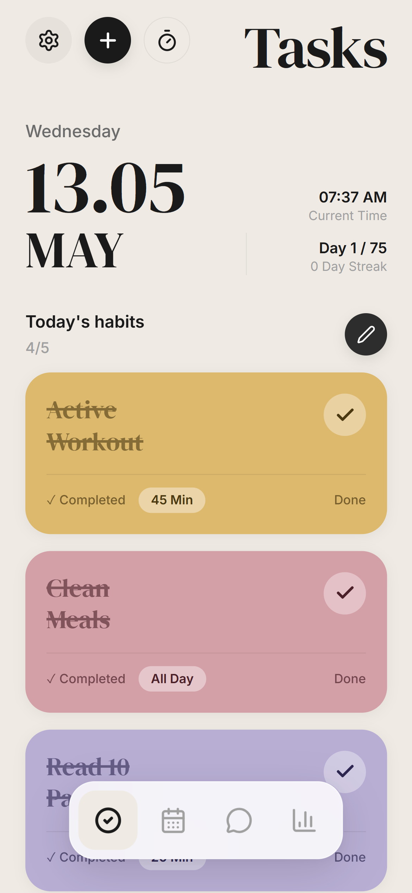
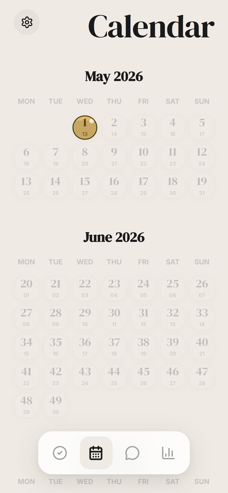
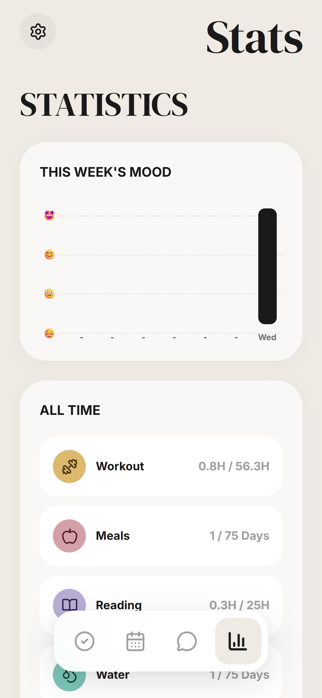
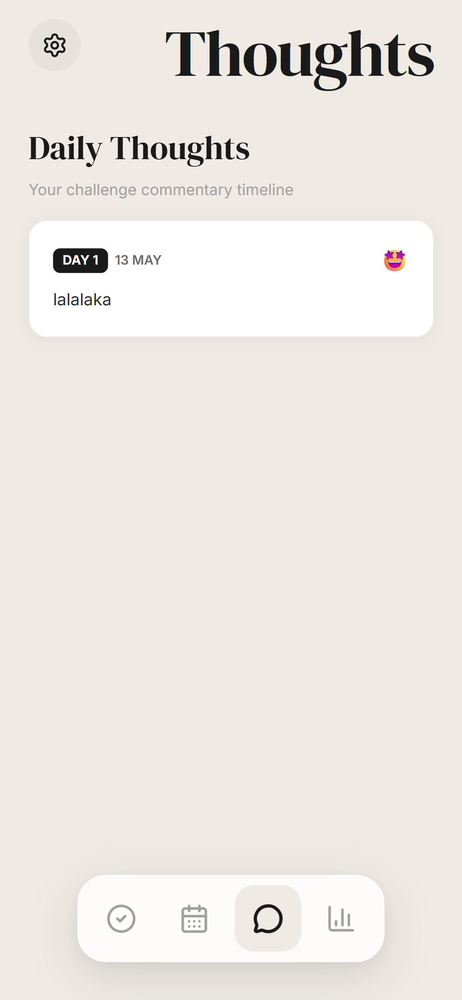
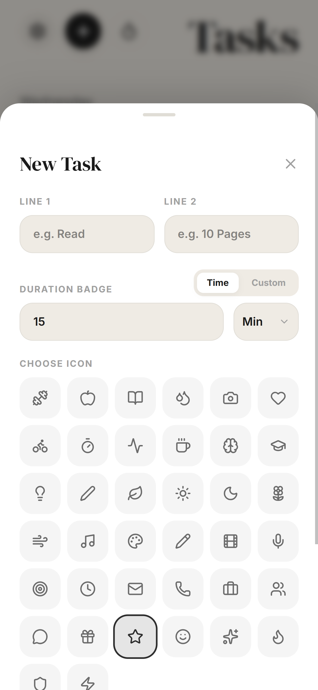
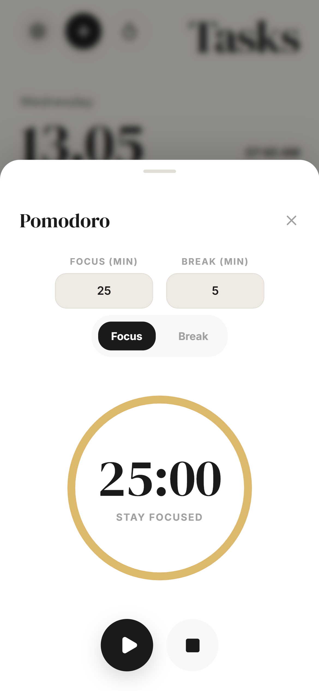
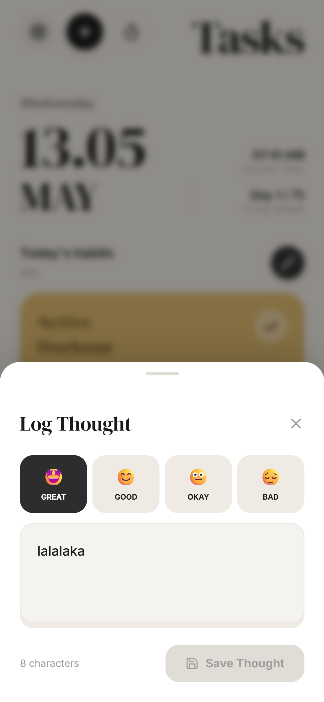

<div align="center">

```
      _  _____ _     _  __   __   ____  _____     _     _   _ 
     | || ____| |   | | \ \ / /  | __ )| ____|   / \   | \ | |
  _  | ||  _| | |   | |  \ V /   |  _ \|  _|    / _ \  |  \| |
 | |_| || |___| |___| |___| |    | |_) | |___  / ___ \ | |\  |
  \___/ |_____|_____|_____|_|    |____/|_____|/_/   \_\|_| \_|
```

### ✨ Master Consistency. Conquer Your Goals. ✨

[Download APK](JellyBean.apk) • [View Handover](handover.md)

---

Jelly Bean is a high-performance React application architected for the **75-Day Challenge**. It leverages a state-driven workflow, fluid hardware-accelerated animations, and a cross-platform Capacitor implementation to provide a seamless habit-tracking experience.

</div>

---

## 📱 Visual Showcase

<div align="center">

| **Tasks** | **Calendar** | **Stats** |
| :---: | :---: | :---: |
|  |  |  |

| **Thoughts** | **Add Task** | **Pomodoro** | **Log Thought** |
| :---: | :---: | :---: | :---: |
|  |  |  |  |

</div>

---

## 🚀 Core Functionality

Jelly Bean implements several integrated modules to ensure reliable performance and user engagement:

- 🗓️ **75-Day Mastery**: A structured journey designed to build unbreakable consistency.
- 🏝️ **Dynamic Navigation Engine**: A custom-built floating dock interface utilizing `motion` for fluid, context-aware layout transitions.
- 📊 **Analytics Dashboard**: Weekly mood telemetry and habit accumulation metrics visualized through dynamic SVG components.
- 📅 **Progress Calendar**: Visualize your entire 75-day journey with interactive day badges and completion heatmaps.
- 📝 **Thought Journal**: Record your daily reflections and track your emotional well-being over time.
- ⏱️ **Integrated Pomodoro**: A built-in focus timer with customizable work and break durations.
- 🎨 **Modular Task System**: CRUD-ready habit management with a modular icon system and persisted custom configuration.
- 🔔 **Scheduled Notification Engine**: Background local notification logic that cycles through a 75-day motivational payload.

---

## 🛠️ Technology Stack

- **Core**: [React 19](https://react.dev/) + [TypeScript](https://www.typescriptlang.org/)
- **Styling**: [Tailwind CSS 4](https://tailwindcss.com/)
- **Animations**: [Motion](https://motion.dev/)
- **Mobile Foundation**: [Capacitor 6](https://capacitorjs.com/)
- **Build Tool**: [Vite 6](https://vitejs.dev/)
- **Icons**: [Lucide React](https://lucide.dev/)

---

## 📦 Getting Started

### Local Development

1. **Clone & Install**:
   ```bash
   git clone <your-repo-url>
   npm install
   ```

2. **Configure Environment**:
   Create a `.env.local` file for any local configuration if needed.

3. **Run Dev Server**:
   ```bash
   npm run dev
   ```

### Mobile Build (Android)

To build the APK yourself:
1. Ensure you have Android Studio and Gradle installed.
2. Run the build sequence:
   ```bash
   npm run build
   npx cap sync android
   cd android && .\gradlew.bat assembleDebug
   ```

---

<div align="center">
Built with ❤️ for the dreamers and the doers.
</div>
